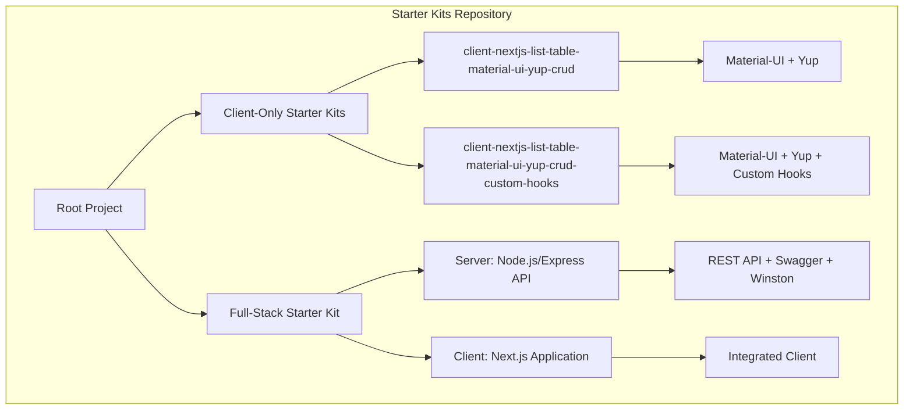
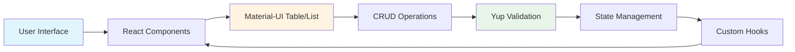
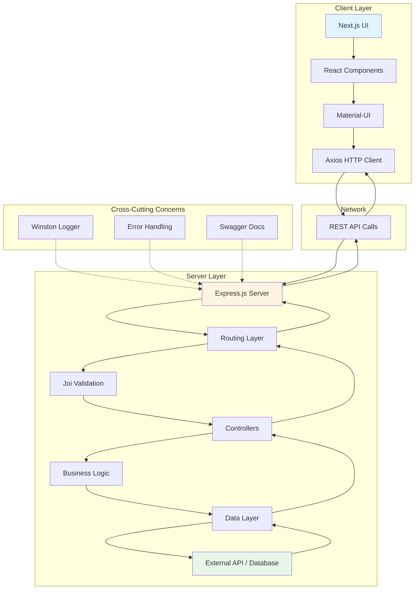
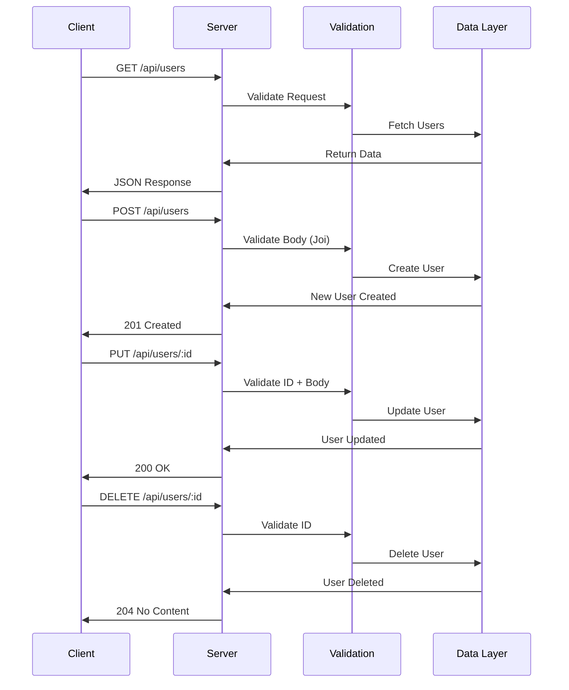
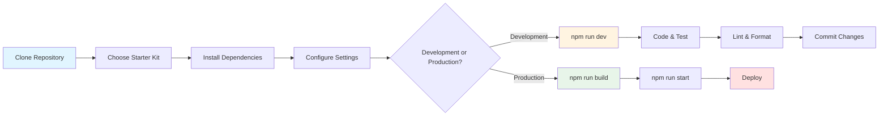

# Starter Kits 2023

A comprehensive collection of React/Next.js and Node.js starter kits for rapid application development. These boilerplates provide production-ready templates for building modern web applications with CRUD functionality, perfect for job interviews, prototypes, or production projects.

Built in April 2023. Features the most powerful packages including React.js, Next.js, Node.js, Express.js, Material-UI, Yup, Joi, SCSS, and more.

## Features

- 🚀 Multiple starter kit options for different use cases
- 📊 Full CRUD functionality out of the box
- 🎨 Material-UI components and theming
- ✅ Input validation with Yup (client) and Joi (server)
- 📱 Responsive design patterns
- 🔧 Express.js REST API with Swagger documentation
- 📝 Comprehensive logging with Winston
- 🧪 ESLint configuration for code quality
- 🎯 Custom React hooks patterns
- 📚 Detailed documentation and examples

## Project Architecture



## Available Starter Kits

### 1. Client Next.js List Table Material UI Yup CRUD

**Path:** `starter-kits/client-nextjs-list-table-material-ui-yup-crud/`

A standalone Next.js client application with table and list views featuring complete CRUD operations.

**Tech Stack:**
- Next.js 13.3
- React 18.2
- Material-UI 5.12
- Yup 1.1 (validation)
- Axios (HTTP client)
- SCSS styling

**Use Case:** Perfect for building admin panels, dashboards, or any data management interface without a backend.

### 2. Client Next.js List Table Material UI Yup CRUD (Custom Hooks)

**Path:** `starter-kits/client-nextjs-list-table-material-ui-yup-crud-custom-hooks/`

Enhanced version of the above with custom React hooks for better code organization and reusability.

**Additional Features:**
- Custom hooks pattern (`useTableHandlers`)
- Improved separation of concerns
- More maintainable code structure

**Use Case:** Ideal for larger projects where code reusability and maintainability are priorities.

### 3. Full-Stack JavaScript Server + Client

**Path:** `starter-kits/javascript-server-node-rest-api-client-nextjs-list-table-material-ui-yup-crud/`

A complete full-stack solution with both server and client applications.

#### Server (Node.js/Express)

**Tech Stack:**
- Express.js 4.18
- Node.js 18+
- Joi 17.9 (validation)
- Winston 3.8 (logging)
- Swagger (API documentation)
- Axios (HTTP client)

**Features:**
- RESTful API endpoints
- Swagger/OpenAPI documentation at `/api-docs`
- Request logging and error handling
- CORS support
- Compression middleware
- Integration with dummy data API

#### Client (Next.js)

Integrated Next.js client configured to work with the server API.

**Use Case:** Complete solution for full-stack development with proper separation between frontend and backend.

## Quick Start

### Prerequisites

- Node.js v18 or higher
- npm, yarn, or pnpm

### Installation

1. Clone the repository:
```bash
git clone https://github.com/orassayag/starter-kits-2023.git
cd starter-kits-2023
```

2. Choose and navigate to a starter kit:
```bash
cd starter-kits/[starter-kit-name]
```

3. Install dependencies:
```bash
npm install
# or
pnpm install
```

4. Run in development mode:
```bash
npm run dev
```

For detailed instructions, see [INSTRUCTIONS.md](INSTRUCTIONS.md).

## Application Flow

### Client-Only Architecture



### Full-Stack Architecture



## API Endpoints (Full-Stack Kit)

### User Management



### Available Endpoints

| Method | Endpoint | Description |
|--------|----------|-------------|
| GET | `/api/users` | Get all users with pagination |
| GET | `/api/users/:id` | Get single user by ID |
| POST | `/api/users` | Create new user |
| PUT | `/api/users/:id` | Update existing user |
| DELETE | `/api/users/:id` | Delete user |

## Project Structure

### Client Application Structure

```
client/
├── public/
│   ├── favicon.ico
│   └── ...
├── src/
│   ├── components/
│   │   ├── CrudTable/
│   │   │   ├── CrudTable.jsx
│   │   │   └── useTableHandlers.hook.js (custom-hooks variant)
│   │   └── ...
│   ├── pages/
│   │   ├── _app.js
│   │   ├── index.js
│   │   └── api/
│   ├── styles/
│   │   └── globals.scss
│   └── utils/
├── .eslintrc.json
├── next.config.js
├── package.json
├── README.md
├── INSTRUCTIONS.md
└── CONTRIBUTING.md
```

### Server Application Structure

```
server/
├── src/
│   ├── bin/
│   │   └── www.js (Entry point)
│   ├── config/
│   │   └── constants.config.js
│   ├── controllers/
│   │   └── users.controller.js
│   ├── custom/
│   │   ├── error.custom.js
│   │   └── event.emitter.custom.js
│   ├── helpers/
│   │   └── express.helper.js
│   ├── middlewares/
│   │   ├── errors.middleware.js
│   │   ├── joi.middleware.js
│   │   └── logs.middleware.js
│   ├── models/
│   │   └── user/
│   │       ├── user.schema.js
│   │       └── users.model.js
│   ├── routes/
│   │   ├── index.public.routes.js
│   │   └── public/
│   │       └── users.routes.js
│   ├── services/
│   │   ├── logger.service.js
│   │   └── swagger.service.js
│   ├── utils/
│   │   ├── apps.utils.js
│   │   ├── data.utils.js
│   │   ├── files.utils.js
│   │   └── networks.utils.js
│   ├── validations/
│   │   └── users/
│   │       ├── get.users.validation.js
│   │       ├── post.users.validation.js
│   │       ├── put.users.validation.js
│   │       └── ...
│   └── app.js
├── logs/
│   └── app-debug.log
├── package.json
└── README.md
```

## Key Technologies

### Frontend

- **Next.js**: React framework with server-side rendering and routing
- **Material-UI**: Comprehensive React component library
- **Yup**: Schema-based form validation
- **Axios**: Promise-based HTTP client
- **SCSS**: Enhanced CSS with variables and nesting
- **ESLint**: Code quality and consistency

### Backend

- **Express.js**: Fast, minimalist web framework
- **Joi**: Powerful schema validation
- **Winston**: Logging library with multiple transports
- **Swagger**: API documentation and testing interface
- **Compression**: Response compression middleware
- **CORS**: Cross-origin resource sharing support

## Development Workflow



## Use Cases

### Job Interviews
- Demonstrate full-stack capabilities
- Show understanding of modern web development
- Quick setup for technical assessments

### Prototyping
- Rapid MVP development
- Client presentations
- Proof of concept applications

### Production Applications
- Admin dashboards
- Content management systems
- User management interfaces
- Data visualization tools

### Learning
- Study Next.js patterns
- Understand REST API design
- Learn Material-UI components
- Practice React hooks

## Customization

### Styling

All client applications use SCSS for styling. Customize colors, spacing, and themes in the styles directory.

### API Integration

For client-only kits, configure API endpoints in the Axios configuration to connect to your backend.

### Validation Rules

Modify Yup schemas (client) and Joi schemas (server) to match your data requirements.

### Components

All components are modular and can be easily customized or extended.

## Contributing

Contributions are welcome! Please read [CONTRIBUTING.md](CONTRIBUTING.md) for details on our code of conduct and the process for submitting pull requests.

Ways to contribute:
- Report bugs and issues
- Suggest new features or starter kits
- Improve documentation
- Submit pull requests
- Share your use cases

## Documentation

- [INSTRUCTIONS.md](INSTRUCTIONS.md) - Detailed setup and usage instructions
- [CONTRIBUTING.md](CONTRIBUTING.md) - Contribution guidelines
- Individual README files in each starter kit directory

## Notes

- The projects are functional boilerplates and may require additional configuration for production use
- Server applications use dummy data from [dummyjson.com](https://dummyjson.com/) - replace with your actual database
- Consider adding authentication, authorization, and proper error tracking for production deployments

## Author

* **Or Assayag** - *Initial work* - [orassayag](https://github.com/orassayag)
* Or Assayag <orassayag@gmail.com>
* GitHub: https://github.com/orassayag
* StackOverflow: https://stackoverflow.com/users/4442606/or-assayag?tab=profile
* LinkedIn: https://linkedin.com/in/orassayag

## License

This application has an MIT license - see the [LICENSE](LICENSE) file for details.
