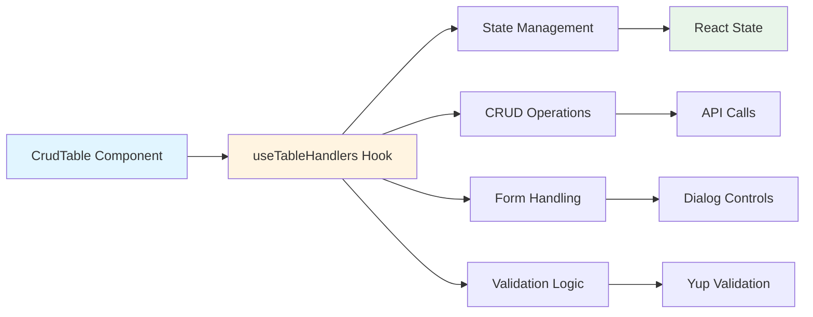
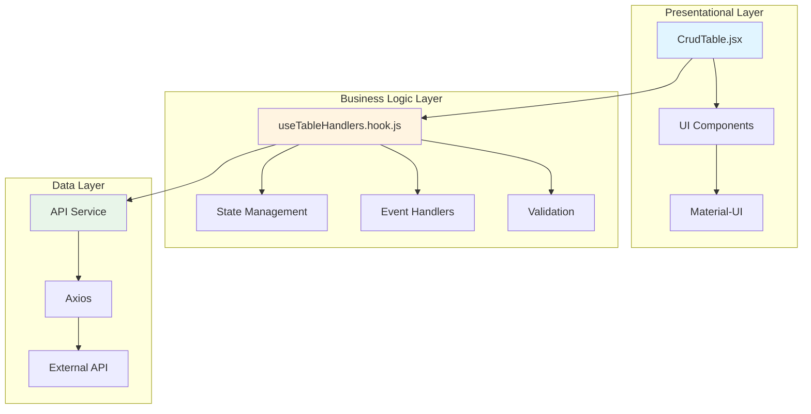
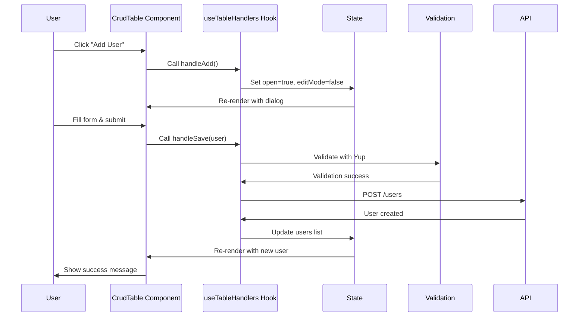

# Client Next.js List Table Material UI Yup CRUD (Custom Hooks)

A production-ready Next.js boilerplate with Material-UI components, Yup validation, and custom React hooks pattern. This enhanced version features better code organization and reusability for CRUD operations.

Built in April 2023. This is a [Next.js](https://nextjs.org/) project bootstrapped with [`create-next-app`](https://github.com/vercel/next.js/tree/canary/packages/create-next-app).

## Features

- 📊 Material-UI table component with sorting and filtering
- 📋 List view with cards
- ✏️ Full CRUD operations (Create, Read, Update, Delete)
- ✅ Form validation with Yup schemas
- 🎯 Custom React hooks for business logic separation
- 🎨 SCSS styling with variables
- 📱 Responsive design
- 🚀 Next.js with server-side rendering
- 🧪 ESLint with Airbnb style guide
- 🔄 Better code reusability and maintainability

## What Makes This Different?

This variant uses **custom React hooks** to separate business logic from UI components, making the code:
- More testable
- Easier to maintain
- More reusable across components
- Better organized

### Custom Hooks Pattern



## Getting Started

### Prerequisites

- Node.js v18 or higher
- npm, yarn, or pnpm

### Installation

1. Navigate to this directory:
```bash
cd starter-kits/client-nextjs-list-table-material-ui-yup-crud-custom-hooks
```

2. Install dependencies:
```bash
npm install
# or
pnpm install
# or
yarn install
```

3. Run the development server:
```bash
npm run dev
# or
pnpm dev
# or
yarn dev
```

4. Open [http://localhost:3000](http://localhost:3000) with your browser to see the result.

### Building for Production

```bash
npm run build
npm run start
```

## Project Structure

```
client-nextjs-list-table-material-ui-yup-crud-custom-hooks/
├── public/
│   ├── favicon.ico
│   └── ...
├── src/
│   ├── components/
│   │   ├── CrudTable/
│   │   │   ├── CrudTable.jsx           # UI component (presentational)
│   │   │   └── useTableHandlers.hook.js # Business logic (custom hook)
│   │   └── ...
│   ├── pages/
│   │   ├── _app.js                     # App wrapper
│   │   ├── index.js                    # Home page
│   │   └── api/
│   ├── styles/
│   │   └── globals.scss                # Global styles
│   └── utils/
├── .eslintrc.json
├── next.config.js
├── package.json
├── README.md
├── INSTRUCTIONS.md
├── CONTRIBUTING.md
└── LICENSE
```

## Architecture

### Separation of Concerns



## Key Components

### CrudTable Component (Presentational)

Focused purely on rendering the UI:

```1:91:starter-kits/client-nextjs-list-table-material-ui-yup-crud-custom-hooks/src/components/CrudTable/CrudTable.jsx
```

### useTableHandlers Hook (Business Logic)

Encapsulates all business logic and state management:

```1:122:starter-kits/client-nextjs-list-table-material-ui-yup-crud-custom-hooks/src/components/CrudTable/useTableHandlers.hook.js
```

## Custom Hook Benefits

### 1. Testability

Test business logic independently from UI:

```javascript
// Easy to test the hook in isolation
import { renderHook, act } from '@testing-library/react-hooks';
import useTableHandlers from './useTableHandlers.hook';

test('should handle add user', async () => {
  const { result } = renderHook(() => useTableHandlers());
  
  act(() => {
    result.current.handleAdd();
  });
  
  expect(result.current.open).toBe(true);
});
```

### 2. Reusability

Use the same hook in multiple components:

```javascript
// In different components
const UserTable = () => {
  const handlers = useTableHandlers('users');
  // Use handlers...
};

const ProductTable = () => {
  const handlers = useTableHandlers('products');
  // Use handlers...
};
```

### 3. Maintainability

All business logic in one place:
- State management
- CRUD operations
- Validation
- Error handling

### 4. Clean Components

Components focus only on rendering:
- No complex logic
- Easy to understand
- Simple props
- Clear responsibilities

## Hook API

### useTableHandlers Hook

**Returns:**

```typescript
{
  // State
  users: User[],
  open: boolean,
  editMode: boolean,
  currentUser: User | null,
  
  // CRUD Handlers
  handleAdd: () => void,
  handleEdit: (user: User) => void,
  handleDelete: (id: number) => void,
  handleSave: (user: User) => Promise<void>,
  
  // Dialog Handlers
  handleClose: () => void,
  
  // View Handlers
  toggleView: () => void,
  isTableView: boolean
}
```

## Data Flow



## Available Scripts

### `npm run dev`

Runs the app in development mode. Opens browser automatically at [http://localhost:3000](http://localhost:3000).

### `npm run build`

Builds the application for production.

### `npm run start`

Starts the production server.

### `npm run lint`

Runs ESLint to check code quality.

## Customization

### Creating New Hooks

Follow this pattern to create additional custom hooks:

```javascript
// useProductHandlers.hook.js
import { useState, useEffect } from 'react';
import axios from 'axios';
import * as yup from 'yup';

const useProductHandlers = () => {
  const [products, setProducts] = useState([]);
  const [loading, setLoading] = useState(false);
  
  const fetchProducts = async () => {
    setLoading(true);
    try {
      const response = await axios.get('/api/products');
      setProducts(response.data);
    } catch (error) {
      console.error(error);
    } finally {
      setLoading(false);
    }
  };
  
  useEffect(() => {
    fetchProducts();
  }, []);
  
  return {
    products,
    loading,
    fetchProducts
  };
};

export default useProductHandlers;
```

### Extending the Hook

Add new functionality to the existing hook:

```javascript
// Add filtering
const [filter, setFilter] = useState('');

const filteredUsers = users.filter(user =>
  user.name.toLowerCase().includes(filter.toLowerCase())
);

return {
  // ... existing returns
  filter,
  setFilter,
  filteredUsers
};
```

## Best Practices

### 1. Keep Hooks Focused

Each hook should have a single responsibility:
- `useTableHandlers` - CRUD operations
- `useFilters` - Filtering logic
- `useSearch` - Search functionality

### 2. Extract Common Logic

Create utility hooks for common patterns:
- `useApi` - API call wrapper
- `useForm` - Form handling
- `useValidation` - Validation logic

### 3. Handle Errors Properly

Always handle errors in hooks:

```javascript
const handleSave = async (user) => {
  try {
    await axios.post('/api/users', user);
  } catch (error) {
    setError(error.message);
    showNotification('Error saving user', 'error');
  }
};
```

### 4. Cleanup Side Effects

Clean up in useEffect:

```javascript
useEffect(() => {
  const controller = new AbortController();
  
  fetchUsers(controller.signal);
  
  return () => controller.abort();
}, []);
```

## Material-UI Components Used

- `Table` - Data table with sorting
- `Dialog` - Modal forms
- `Card` - List view items
- `Button` - Action buttons
- `TextField` - Form inputs
- `IconButton` - Icon actions
- `Snackbar` - Notifications

## Dependencies

### Main Dependencies

- `next` - Next.js framework
- `react` - React library
- `@mui/material` - Material-UI components
- `@mui/icons-material` - Material-UI icons
- `yup` - Schema validation
- `axios` - HTTP client
- `sass` - SCSS support

### Dev Dependencies

- `eslint` - Code linting
- `eslint-config-airbnb` - Airbnb style guide
- `eslint-plugin-security` - Security checks

## Learn More

### React Hooks Resources

- [React Hooks Documentation](https://react.dev/reference/react)
- [Rules of Hooks](https://react.dev/warnings/invalid-hook-call-warning)
- [Custom Hooks Guide](https://react.dev/learn/reusing-logic-with-custom-hooks)

### Next.js Resources

- [Next.js Documentation](https://nextjs.org/docs)
- [Learn Next.js](https://nextjs.org/learn)

### Material-UI Resources

- [Material-UI Documentation](https://mui.com/material-ui/getting-started/)

## Deployment

Deploy on [Vercel](https://vercel.com/new), [Netlify](https://www.netlify.com/), or any platform supporting Next.js.

See [Next.js deployment documentation](https://nextjs.org/docs/deployment) for details.

## Contributing

Contributions are welcome! Please see [CONTRIBUTING.md](CONTRIBUTING.md) for details.

## Author

* **Or Assayag** - *Initial work* - [orassayag](https://github.com/orassayag)
* Or Assayag <orassayag@gmail.com>
* GitHub: https://github.com/orassayag
* StackOverflow: https://stackoverflow.com/users/4442606/or-assayag?tab=profile
* LinkedIn: https://linkedin.com/in/orassayag

## License

This application has an MIT license - see the [LICENSE](LICENSE) file for details.
