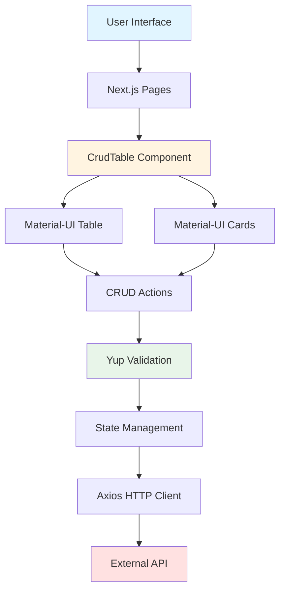
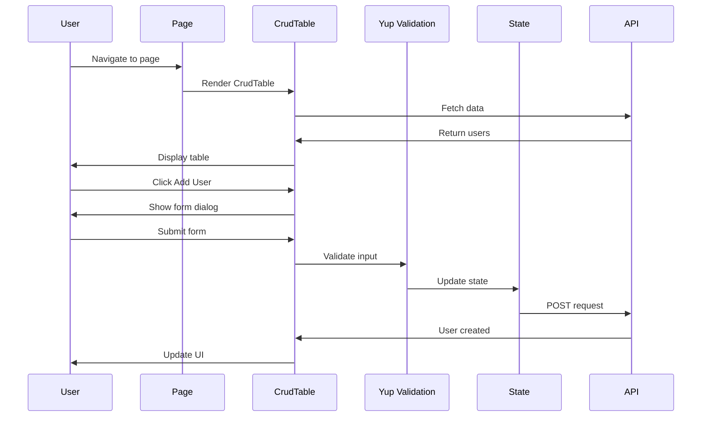

# Client Next.js List Table Material UI Yup CRUD

A production-ready Next.js boilerplate with Material-UI table and list components, featuring full CRUD operations and Yup validation. Perfect for building admin panels, dashboards, and data management interfaces.

Built in April 2023. This is a [Next.js](https://nextjs.org/) project bootstrapped with [`create-next-app`](https://github.com/vercel/next.js/tree/canary/packages/create-next-app).

## Features

- 📊 Material-UI table component with sorting and filtering
- 📋 List view with cards
- ✏️ Full CRUD operations (Create, Read, Update, Delete)
- ✅ Form validation with Yup schemas
- 🎨 SCSS styling with variables
- 📱 Responsive design
- 🚀 Next.js with server-side rendering
- 🧪 ESLint with Airbnb style guide
- 🔒 Security plugins enabled

## Architecture



## Getting Started

### Prerequisites

- Node.js v18 or higher
- npm, yarn, or pnpm

### Installation

1. Navigate to this directory:
```bash
cd starter-kits/client-nextjs-list-table-material-ui-yup-crud
```

2. Install dependencies:
```bash
npm install
# or
pnpm install
# or
yarn install
```

3. Run the development server:
```bash
npm run dev
# or
pnpm dev
# or
yarn dev
```

4. Open [http://localhost:3000](http://localhost:3000) with your browser to see the result.

### Building for Production

```bash
npm run build
npm run start
```

## Project Structure

```
client-nextjs-list-table-material-ui-yup-crud/
├── public/
│   ├── favicon.ico
│   └── ...
├── src/
│   ├── components/
│   │   ├── CrudTable/
│   │   │   └── CrudTable.jsx         # Main CRUD table component
│   │   └── ...
│   ├── pages/
│   │   ├── _app.js                   # App wrapper
│   │   ├── index.js                  # Home page
│   │   └── api/
│   ├── styles/
│   │   └── globals.scss              # Global styles
│   └── utils/
├── .eslintrc.json
├── next.config.js
├── package.json
├── README.md
├── INSTRUCTIONS.md
├── CONTRIBUTING.md
└── LICENSE
```

## Component Flow



## Key Features Explained

### CrudTable Component

The main component that handles all CRUD operations:

```1:91:starter-kits/client-nextjs-list-table-material-ui-yup-crud/src/components/CrudTable/CrudTable.jsx
```

Features:
- Table and list view toggle
- Add, edit, delete operations
- Form validation with Yup
- Material-UI dialogs and components
- Error handling

### Yup Validation

Example validation schema:
```javascript
const userSchema = yup.object().shape({
  firstName: yup.string().required('First name is required'),
  lastName: yup.string().required('Last name is required'),
  email: yup.string().email('Invalid email').required('Email is required'),
  age: yup.number().positive().integer().required('Age is required')
});
```

### Styling

All styles use SCSS for better organization:
- Variables for colors and spacing
- Nested selectors
- Mixins for responsive design

## Available Scripts

### `npm run dev`

Runs the app in development mode. Opens browser automatically at [http://localhost:3000](http://localhost:3000). The page auto-updates as you edit files.

### `npm run build`

Builds the application for production. Optimizes the build for best performance.

### `npm run start`

Starts the production server after building.

### `npm run lint`

Runs ESLint to check code quality.

## Customization

### Changing the API Endpoint

Edit the Axios configuration in the CrudTable component to point to your API:

```javascript
const API_URL = 'https://your-api.com/users';
```

### Styling

Modify `src/styles/globals.scss` to change colors, fonts, or spacing:

```scss
$primary-color: #1976d2;
$secondary-color: #dc004e;
```

### Validation Rules

Update the Yup schema in the CrudTable component to match your data requirements.

## Material-UI Components Used

- `Table` - Data table with sorting
- `Dialog` - Modal forms for add/edit
- `Card` - List view items
- `Button` - Action buttons
- `TextField` - Form inputs
- `IconButton` - Icon actions
- `Snackbar` - Success/error notifications

## Dependencies

### Main Dependencies

- `next` - Next.js framework
- `react` - React library
- `@mui/material` - Material-UI components
- `@mui/icons-material` - Material-UI icons
- `yup` - Schema validation
- `axios` - HTTP client
- `sass` - SCSS support

### Dev Dependencies

- `eslint` - Code linting
- `eslint-config-airbnb` - Airbnb style guide
- `eslint-plugin-security` - Security checks

## Learn More

### Next.js Resources

- [Next.js Documentation](https://nextjs.org/docs) - Learn about Next.js features and API
- [Learn Next.js](https://nextjs.org/learn) - Interactive Next.js tutorial
- [Next.js GitHub repository](https://github.com/vercel/next.js/)

### Material-UI Resources

- [Material-UI Documentation](https://mui.com/material-ui/getting-started/)
- [Material-UI Components](https://mui.com/material-ui/all-components/)

### Yup Resources

- [Yup Documentation](https://github.com/jquense/yup)

## Deployment

### Vercel

The easiest way to deploy your Next.js app is to use the [Vercel Platform](https://vercel.com/new?utm_medium=default-template&filter=next.js&utm_source=create-next-app&utm_campaign=create-next-app-readme).

Check out the [Next.js deployment documentation](https://nextjs.org/docs/deployment) for more details.

### Other Platforms

- **Netlify**: Connect your GitHub repository
- **AWS Amplify**: Use the Amplify CLI
- **Docker**: Create a Dockerfile and deploy to any container platform

## Notes

- This project is a boilerplate/starter kit and may require additional configuration for production use
- Consider adding authentication and authorization for production deployments
- The example uses mock data - replace with your actual API
- Add error tracking (Sentry, LogRocket) for production monitoring

## Contributing

Contributions are welcome! Please see [CONTRIBUTING.md](CONTRIBUTING.md) for details.

## Author

* **Or Assayag** - *Initial work* - [orassayag](https://github.com/orassayag)
* Or Assayag <orassayag@gmail.com>
* GitHub: https://github.com/orassayag
* StackOverflow: https://stackoverflow.com/users/4442606/or-assayag?tab=profile
* LinkedIn: https://linkedin.com/in/orassayag

## License

This application has an MIT license - see the [LICENSE](LICENSE) file for details.
