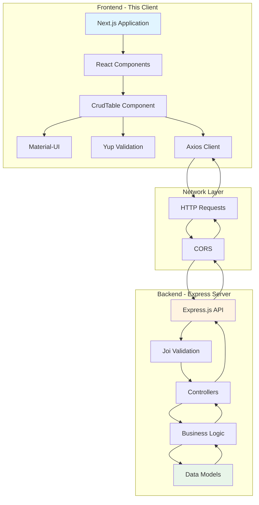
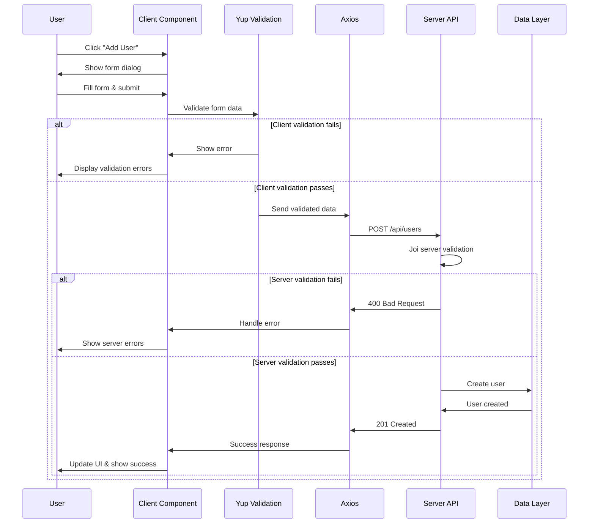
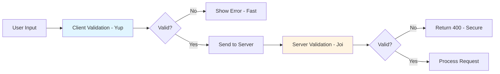
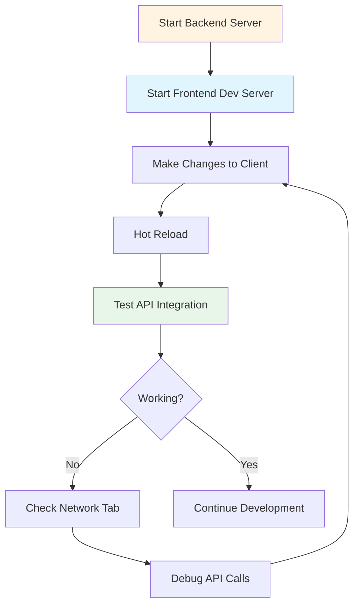

# Client - Full-Stack CRUD Application

A Next.js client application integrated with the Node.js/Express backend server. This client is part of a full-stack solution featuring Material-UI components, Yup validation, and complete CRUD functionality.

Built in April 2023. This is a [Next.js](https://nextjs.org/) project configured to work seamlessly with the accompanying Express.js REST API server.

## Features

- 📊 Material-UI table and list components
- ✏️ Full CRUD operations (Create, Read, Update, Delete)
- ✅ Form validation with Yup
- 🔄 API integration with the backend server
- 🎨 SCSS styling
- 📱 Responsive design
- 🚀 Next.js with server-side rendering
- 🔒 CORS configured for backend communication

## Full-Stack Architecture



## Getting Started

### Prerequisites

- Node.js v18 or higher
- npm or pnpm
- Backend server running (see server directory)

### Installation

1. Navigate to the client directory:
```bash
cd starter-kits/javascript-server-node-rest-api-client-nextjs-list-table-material-ui-yup-crud/client
```

2. Install dependencies:
```bash
npm install
# or
pnpm install
```

3. **Start the backend server first** (in a separate terminal):
```bash
cd ../server
npm install
npm run dev
```

4. Start the client development server:
```bash
npm run dev
```

5. Open [http://localhost:3000](http://localhost:3000) in your browser.

## Project Structure

```
client/
├── public/
│   ├── favicon.ico
│   └── ...
├── src/
│   ├── components/
│   │   ├── CrudTable/
│   │   │   └── CrudTable.jsx         # Main CRUD component
│   │   └── ...
│   ├── pages/
│   │   ├── _app.js                   # App wrapper
│   │   ├── index.js                  # Home page
│   │   └── api/                      # API route handlers
│   ├── styles/
│   │   └── globals.scss              # Global styles
│   └── utils/
│       └── api.js                    # API configuration
├── .eslintrc.json
├── next.config.js
├── package.json
└── README.md
```

## API Integration

### Configuration

The client is pre-configured to communicate with the backend API:

```javascript
// src/utils/api.js
import axios from 'axios';

const API_BASE_URL = process.env.NEXT_PUBLIC_API_URL || 'http://localhost:3000/api';

export const api = axios.create({
  baseURL: API_BASE_URL,
  headers: {
    'Content-Type': 'application/json'
  }
});
```

### Environment Variables

Create a `.env.local` file:

```env
NEXT_PUBLIC_API_URL=http://localhost:3000/api
```

## Communication Flow



## Dual Validation

This application implements dual validation for robust data integrity:

### 1. Client-Side Validation (Yup)

Fast, immediate feedback for users:

```javascript
import * as yup from 'yup';

const userSchema = yup.object().shape({
  firstName: yup.string()
    .min(2, 'Too short')
    .max(50, 'Too long')
    .required('First name is required'),
  email: yup.string()
    .email('Invalid email')
    .required('Email is required'),
  age: yup.number()
    .positive('Must be positive')
    .integer('Must be integer')
    .required('Age is required')
});
```

### 2. Server-Side Validation (Joi)

Secure, authoritative validation on the backend:

```javascript
// Server validates again for security
const userSchema = Joi.object({
  firstName: Joi.string().min(2).max(50).required(),
  email: Joi.string().email().required(),
  age: Joi.number().integer().min(1).max(150).required()
});
```

### Why Dual Validation?



**Benefits:**
- **UX**: Instant client-side feedback
- **Security**: Server validates untrusted data
- **Defense**: Multiple layers of protection
- **Consistency**: Matching validation rules

## Available API Endpoints

The client communicates with these server endpoints:

| Method | Endpoint | Action | Component Method |
|--------|----------|--------|------------------|
| GET | `/api/users` | Fetch all users | `fetchUsers()` |
| GET | `/api/users/:id` | Get user by ID | `getUser(id)` |
| POST | `/api/users` | Create user | `createUser(user)` |
| PUT | `/api/users/:id` | Update user | `updateUser(id, user)` |
| DELETE | `/api/users/:id` | Delete user | `deleteUser(id)` |

## CRUD Operations

### Fetch Users

```javascript
const fetchUsers = async () => {
  try {
    const response = await api.get('/users');
    setUsers(response.data.users);
  } catch (error) {
    console.error('Error fetching users:', error);
  }
};
```

### Create User

```javascript
const createUser = async (user) => {
  try {
    await userSchema.validate(user); // Client validation
    const response = await api.post('/users', user);
    // User created and validated by server
    return response.data;
  } catch (error) {
    if (error.name === 'ValidationError') {
      // Yup validation error
      showError(error.message);
    } else if (error.response?.status === 400) {
      // Server validation error
      showError(error.response.data.error.message);
    }
  }
};
```

### Update User

```javascript
const updateUser = async (id, updates) => {
  try {
    await userSchema.validate(updates);
    const response = await api.put(`/users/${id}`, updates);
    return response.data;
  } catch (error) {
    handleError(error);
  }
};
```

### Delete User

```javascript
const deleteUser = async (id) => {
  try {
    await api.delete(`/users/${id}`);
    // Remove from local state
    setUsers(users.filter(u => u.id !== id));
  } catch (error) {
    handleError(error);
  }
};
```

## Error Handling

### Client-Side Errors

```javascript
const handleError = (error) => {
  if (error.response) {
    // Server responded with error
    const { status, data } = error.response;
    
    if (status === 400) {
      showNotification('Validation failed', 'error');
    } else if (status === 404) {
      showNotification('User not found', 'error');
    } else if (status === 500) {
      showNotification('Server error', 'error');
    }
  } else if (error.request) {
    // Request made but no response
    showNotification('Network error', 'error');
  } else {
    // Client-side error
    showNotification('Error: ' + error.message, 'error');
  }
};
```

## Available Scripts

### `npm run dev`

Runs the app in development mode. Opens browser automatically at [http://localhost:3000](http://localhost:3000).

**Note:** Ensure the backend server is running first.

### `npm run build`

Builds the application for production.

### `npm run start`

Starts the production server after building.

### `npm run lint`

Runs ESLint to check code quality.

## Material-UI Components

This client uses Material-UI v5 components:

- `Table`, `TableBody`, `TableCell`, `TableHead`, `TableRow` - Data tables
- `Dialog`, `DialogTitle`, `DialogContent`, `DialogActions` - Modal forms
- `Card`, `CardContent`, `CardActions` - List view
- `Button`, `IconButton` - Actions
- `TextField` - Form inputs
- `Snackbar`, `Alert` - Notifications

## Styling

### Global Styles

Edit `src/styles/globals.scss`:

```scss
// Variables
$primary-color: #1976d2;
$secondary-color: #dc004e;
$success-color: #4caf50;
$error-color: #f44336;

// Apply styles
.crud-table {
  background-color: white;
  border-radius: 8px;
  padding: 16px;
}
```

### Component Styles

Use SCSS modules or Material-UI's styling solutions:

```javascript
import { styled } from '@mui/material/styles';

const StyledButton = styled(Button)(({ theme }) => ({
  backgroundColor: theme.palette.primary.main,
  '&:hover': {
    backgroundColor: theme.palette.primary.dark
  }
}));
```

## Development Workflow



## Troubleshooting

### CORS Errors

If you see CORS errors in the console:

1. Ensure the backend server is running
2. Check CORS configuration in `server/src/app.js`
3. Verify the API URL in `.env.local`

### Connection Refused

If API calls fail with "Connection refused":

1. Start the backend server first
2. Check the server is running on the correct port
3. Verify `NEXT_PUBLIC_API_URL` in environment variables

### Validation Errors

If data isn't saving:

1. Check browser console for Yup validation errors
2. Check network tab for server validation errors
3. Ensure client and server schemas match

## Dependencies

### Main Dependencies

- `next` - Next.js framework
- `react` - React library
- `@mui/material` - Material-UI components
- `@mui/icons-material` - Material-UI icons
- `yup` - Client validation
- `axios` - HTTP client
- `sass` - SCSS support

### Dev Dependencies

- `eslint` - Code linting
- `eslint-config-airbnb` - Airbnb style guide
- `eslint-plugin-security` - Security checks

## Production Deployment

### Environment Variables

Set production API URL:

```env
NEXT_PUBLIC_API_URL=https://your-api-domain.com/api
```

### Build and Deploy

```bash
npm run build
npm run start
```

### Deployment Platforms

- **Vercel**: Automatic deployment from Git
- **Netlify**: Connect repository
- **AWS Amplify**: Use Amplify Console
- **Docker**: Containerize with backend

## Learn More

### Resources

- [Next.js Documentation](https://nextjs.org/docs)
- [Material-UI Documentation](https://mui.com/material-ui/getting-started/)
- [Axios Documentation](https://axios-http.com/docs/intro)
- [Yup Documentation](https://github.com/jquense/yup)

## Contributing

Contributions are welcome! Please see [CONTRIBUTING.md](../../../CONTRIBUTING.md) for details.

## Author

* **Or Assayag** - *Initial work* - [orassayag](https://github.com/orassayag)
* Or Assayag <orassayag@gmail.com>
* GitHub: https://github.com/orassayag
* StackOverflow: https://stackoverflow.com/users/4442606/or-assayag?tab=profile
* LinkedIn: https://linkedin.com/in/orassayag

## License

This application has an MIT license - see the [LICENSE](LICENSE) file for details.
