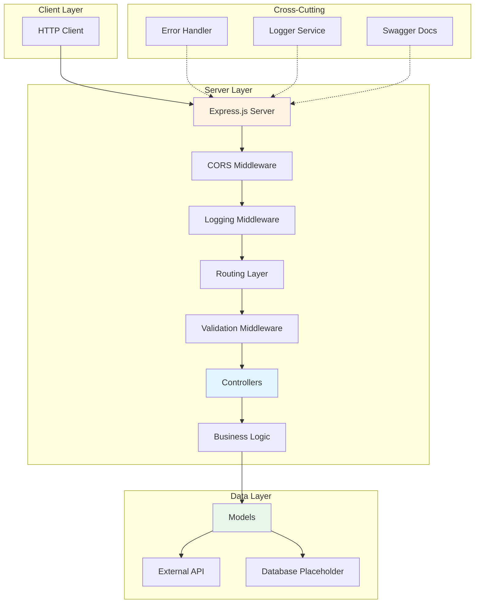
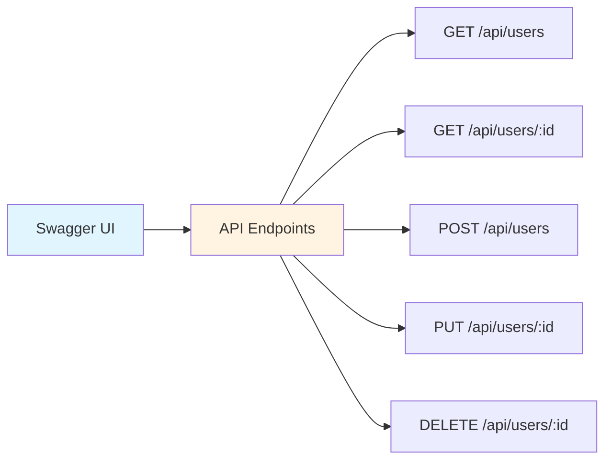
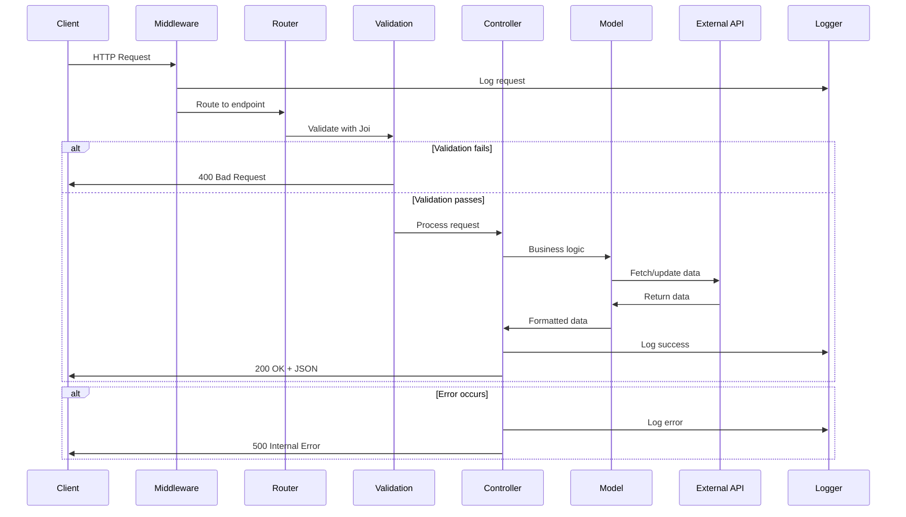
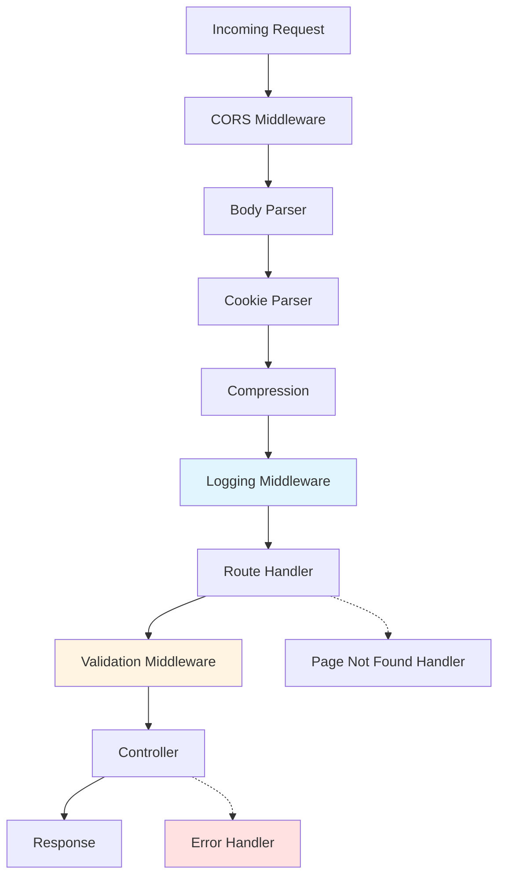

# Node.js Express REST API Server

A production-ready Node.js/Express.js REST API server with full CRUD operations, Swagger/OpenAPI documentation, Joi validation, and Winston logging. Perfect boilerplate for building scalable backend services.

Built in April 2023. This server integrates with dummy data from [dummyjson.com](https://dummyjson.com/) for rapid prototyping and can be easily adapted for real database integration.

## Features

- 🚀 Express.js 4.18 with ES6 modules
- 📚 Swagger/OpenAPI documentation
- ✅ Joi validation for request data
- 📝 Winston logging with file and console transports
- 🔧 Error handling middleware
- 🔒 CORS support
- 📦 Compression middleware
- 🧪 ESLint with Airbnb style guide
- 🔄 Nodemon for development
- 🎯 RESTful API design
- 🌐 Integration with external APIs

## Architecture



## Getting Started

### Prerequisites

- Node.js v18 or higher
- npm or pnpm

### Installation

1. Navigate to the server directory:
```bash
cd starter-kits/javascript-server-node-rest-api-client-nextjs-list-table-material-ui-yup-crud/server
```

2. Install dependencies:
```bash
npm install
# or
pnpm install
```

3. Run the development server:
```bash
npm run dev
```

The server will start and be available at `http://localhost:3000` (or the port specified in your environment).

## API Documentation

Once the server is running, access the interactive Swagger documentation at:

**`http://localhost:3000/api-docs`**

The Swagger UI provides:
- Complete API reference
- Interactive endpoint testing
- Request/response schemas
- Authentication details (when implemented)



## Project Structure

```
server/
├── src/
│   ├── bin/
│   │   └── www.js                      # Server entry point
│   ├── config/
│   │   ├── constants.config.js         # Application constants
│   │   └── env.js                      # Environment configuration
│   ├── controllers/
│   │   └── users.controller.js         # User CRUD controller
│   ├── custom/
│   │   ├── error.custom.js             # Custom error class
│   │   └── event.emitter.custom.js     # Event emitter
│   ├── helpers/
│   │   └── express.helper.js           # Express utilities
│   ├── middlewares/
│   │   ├── errors.middleware.js        # Error handling
│   │   ├── joi.middleware.js           # Validation middleware
│   │   └── logs.middleware.js          # Request logging
│   ├── models/
│   │   └── user/
│   │       ├── user.schema.js          # User schema definition
│   │       └── users.model.js          # User data model
│   ├── routes/
│   │   ├── index.public.routes.js      # Main router
│   │   └── public/
│   │       └── users.routes.js         # User routes
│   ├── services/
│   │   ├── logger.service.js           # Winston logger
│   │   └── swagger.service.js          # Swagger configuration
│   ├── utils/
│   │   ├── apps.utils.js               # Application utilities
│   │   ├── data.utils.js               # Data manipulation
│   │   ├── files.utils.js              # File operations
│   │   └── networks.utils.js           # Network utilities
│   ├── validations/
│   │   └── users/
│   │       ├── get.users.validation.js
│   │       ├── getById.users.validation.js
│   │       ├── post.users.validation.js
│   │       ├── put.users.validation.js
│   │       ├── remove.users.validation.js
│   │       └── base/
│   │           ├── user.body.validation.js
│   │           └── user.id.validation.js
│   └── app.js                          # Express app configuration
├── logs/
│   └── app-debug.log                   # Application logs
├── package.json
└── README.md
```

## Request Flow



## API Endpoints

### Users

| Method | Endpoint | Description | Request Body | Response |
|--------|----------|-------------|--------------|----------|
| GET | `/api/users` | Get all users | - | `{ users: User[], total: number }` |
| GET | `/api/users/:id` | Get user by ID | - | `{ user: User }` |
| POST | `/api/users` | Create new user | `User` | `{ user: User }` |
| PUT | `/api/users/:id` | Update user | `Partial<User>` | `{ user: User }` |
| DELETE | `/api/users/:id` | Delete user | - | `{ success: boolean }` |

### User Schema

```javascript
{
  id: number,
  firstName: string,
  lastName: string,
  email: string,
  age: number,
  phone?: string,
  address?: string
}
```

## Validation

All requests are validated using Joi schemas before reaching controllers.

### Example: POST /api/users validation

```javascript
const userSchema = Joi.object({
  firstName: Joi.string().min(2).max(50).required(),
  lastName: Joi.string().min(2).max(50).required(),
  email: Joi.string().email().required(),
  age: Joi.number().integer().min(1).max(150).required(),
  phone: Joi.string().optional(),
  address: Joi.string().optional()
});
```

### Validation Error Response

```json
{
  "error": {
    "message": "Validation failed",
    "details": [
      {
        "field": "email",
        "message": "\"email\" must be a valid email"
      }
    ]
  }
}
```

## Logging

Winston logger with multiple transports:

- **Console**: Development logging
- **File**: All logs to `logs/app-debug.log`

### Log Levels

```javascript
logger.info('User created successfully');
logger.warn('Invalid request attempt');
logger.error('Database connection failed', { error });
logger.debug('Debug information', { data });
```

### Example Log Output

```
2023-04-15 10:30:45 [INFO]: Server started on port 3000
2023-04-15 10:31:12 [INFO]: GET /api/users - 200 - 45ms
2023-04-15 10:31:25 [ERROR]: POST /api/users - Validation failed - email required
```

## Middleware Stack



## Available Scripts

### `npm run dev`

Runs the server in development mode with:
- Nodemon for auto-restart
- Source map support
- Debug mode enabled
- Watch on `.js`, `.json`, `.yaml`, `.ejs` files

### `npm run test`

Runs the test suite (Mocha).

### `npm run dev-test`

Runs tests in development mode with local environment.

## Configuration

### Environment Variables

Create a `.env` file or configure in `src/config/env.js`:

```javascript
export default {
  server: {
    port: process.env.PORT || 3000,
    env: process.env.NODE_ENV || 'development'
  },
  api: {
    baseUrl: 'https://dummyjson.com'
  }
};
```

### Constants

Edit `src/config/constants.config.js`:

```javascript
export default {
  SERVER: {
    PORT: 3000,
    EXPRESS_LIMIT: '50mb'
  },
  AUTH: {
    HTTP_HEADERS: {
      AUTHORIZATION: 'Authorization'
    }
  },
  EVENTS: {
    SERVER_UP: 'server-up'
  }
};
```

## Error Handling

### Custom Error Class

```javascript
class CustomError extends Error {
  constructor(message, statusCode = 500) {
    super(message);
    this.statusCode = statusCode;
    this.isOperational = true;
  }
}
```

### Error Response Format

```json
{
  "error": {
    "message": "User not found",
    "statusCode": 404,
    "timestamp": "2023-04-15T10:30:45.123Z"
  }
}
```

## Adding New Endpoints

### 1. Create Validation Schema

```javascript
// src/validations/products/post.products.validation.js
import Joi from 'joi';

export default Joi.object({
  name: Joi.string().required(),
  price: Joi.number().positive().required(),
  description: Joi.string().optional()
});
```

### 2. Create Controller

```javascript
// src/controllers/products.controller.js
class ProductsController {
  static async getProducts(req, res, next) {
    try {
      const products = await ProductsModel.getAll();
      res.json({ products });
    } catch (error) {
      next(error);
    }
  }
}

export default ProductsController;
```

### 3. Create Routes

```javascript
// src/routes/public/products.routes.js
import express from 'express';
import ProductsController from '../../controllers/products.controller.js';
import validation from '../../validations/products/get.products.validation.js';
import JoiMiddleware from '../../middlewares/joi.middleware.js';

const router = express.Router();

router.get(
  '/',
  JoiMiddleware.validate(validation),
  ProductsController.getProducts
);

export default router;
```

### 4. Register Routes

```javascript
// src/routes/index.public.routes.js
import productsRoutes from './public/products.routes.js';

app.use('/api/products', productsRoutes);
```

### 5. Update Swagger

The Swagger documentation auto-generates based on JSDoc comments:

```javascript
/**
 * @swagger
 * /api/products:
 *   get:
 *     summary: Get all products
 *     tags: [Products]
 *     responses:
 *       200:
 *         description: List of products
 */
```

## Database Integration

Currently uses dummy data. To integrate a real database:

### Option 1: MongoDB

```bash
npm install mongoose
```

```javascript
// src/config/database.js
import mongoose from 'mongoose';

export const connect = async () => {
  await mongoose.connect(process.env.MONGODB_URI);
};
```

### Option 2: PostgreSQL

```bash
npm install pg sequelize
```

### Option 3: MySQL

```bash
npm install mysql2 sequelize
```

## Security Considerations

### Current Security Features

- ✅ CORS enabled
- ✅ Input validation (Joi)
- ✅ Error handling
- ✅ Logging

### Additional Security Recommendations

- 🔒 Add authentication (JWT, sessions)
- 🔒 Add authorization/RBAC
- 🔒 Use helmet.js for headers
- 🔒 Add rate limiting
- 🔒 Implement HTTPS
- 🔒 Use environment variables for secrets
- 🔒 Add request sanitization
- 🔒 Implement CSRF protection

## Performance Optimization

### Current Optimizations

- ✅ Compression middleware
- ✅ Efficient error handling
- ✅ Async/await patterns

### Additional Recommendations

- 🚀 Add caching (Redis)
- 🚀 Database query optimization
- 🚀 Use connection pooling
- 🚀 Implement pagination
- 🚀 Add response caching headers
- 🚀 Use clustering for multi-core

## Dependencies

### Main Dependencies

- `express` - Web framework
- `joi` - Validation
- `winston` - Logging
- `axios` - HTTP client
- `cors` - CORS support
- `compression` - Response compression
- `swagger-jsdoc` - Swagger generation
- `swagger-ui-express` - Swagger UI
- `cookie-parser` - Cookie handling
- `body-parser` - Request parsing

### Dev Dependencies

- `nodemon` - Development auto-restart
- `eslint` - Code linting
- `@babel/eslint-parser` - Babel integration

## Deployment

### Production Checklist

- [ ] Set `NODE_ENV=production`
- [ ] Configure production database
- [ ] Set up environment variables
- [ ] Enable HTTPS
- [ ] Add authentication
- [ ] Set up monitoring
- [ ] Configure logging
- [ ] Add rate limiting
- [ ] Set up backup strategy
- [ ] Configure CORS for production domains

### Deployment Platforms

- **Heroku**: Push to Git
- **AWS**: EC2, Elastic Beanstalk, or Lambda
- **Google Cloud**: App Engine or Cloud Run
- **DigitalOcean**: App Platform or Droplets
- **Docker**: Containerize and deploy anywhere

## Contributing

Contributions are welcome! Please see [CONTRIBUTING.md](../../../CONTRIBUTING.md) for details.

## Author

* **Or Assayag** - *Initial work* - [orassayag](https://github.com/orassayag)
* Or Assayag <orassayag@gmail.com>
* GitHub: https://github.com/orassayag
* StackOverflow: https://stackoverflow.com/users/4442606/or-assayag?tab=profile
* LinkedIn: https://linkedin.com/in/orassayag

## License

This application has an MIT license - see the [LICENSE](LICENSE) file for details.
